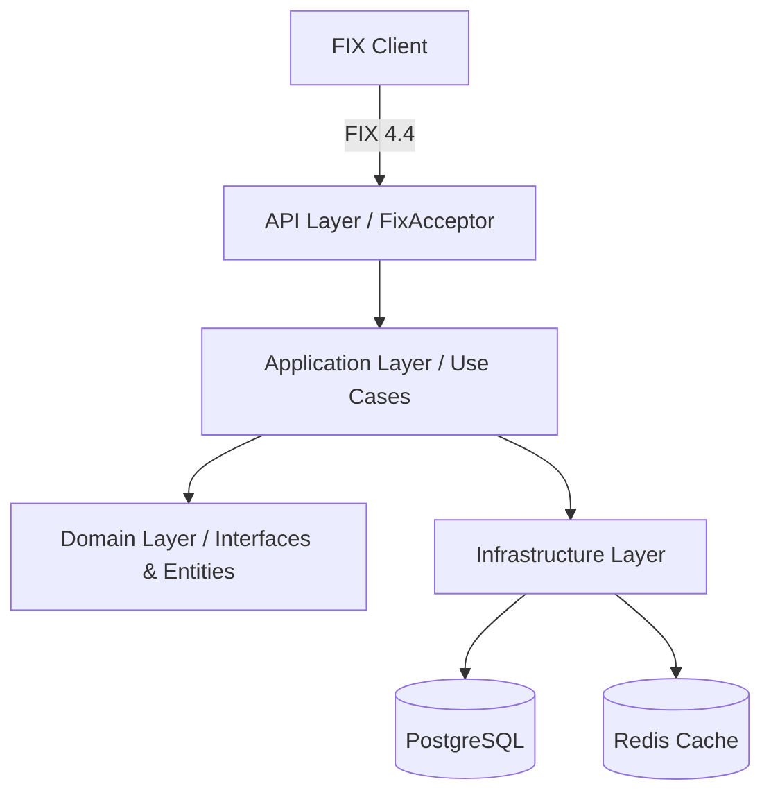

# Order Accumulator

Order Accumulator is a professional-grade exchange system designed to receive, process, and validate financial orders using the **FIX 4.4 (Financial Information eXchange)** protocol. The system focuses on real-time asset exposure tracking to ensure that no single asset exceeds a predefined risk limit.

## 🚀 Purpose

The primary goal of the project is to act as a gateway for order execution, providing a critical safety layer by validating the total financial exposure per asset before accepting an order. This prevents excessive risk concentration in any single security.

## ✨ Features

- **FIX 4.4 Protocol Integration**: Full implementation of a FIX acceptor to handle `NewOrderSingle` messages and respond with `ExecutionReport`.
- **Real-time Exposure Tracking**: Tracks the net value of assets ($\text{Buy Orders} - \text{Sell Orders}$).
- **Risk Validation**: Automatically rejects orders if the resulting exposure for an asset exceeds the maximum limit of **100,000,000.00**.
- **Distributed Caching**: Uses **Redis** for ultra-fast, shared state management of asset exposure across multiple application instances.
- **Persistent Storage**: Utilizes **PostgreSQL** for a reliable and ACID-compliant record of all executed orders and system symbols.
- **Boot-time Synchronization**: Automatic cache hydration from the database on startup to maintain state consistency.

## 🛠 Tech Stack

- **Backend**: .NET 10 (C#)
- **Database**: PostgreSQL (via Entity Framework Core)
- **Cache**: Redis (via `IDistributedCache`)
- **Protocol**: QuickFIXn (FIX 4.4)
- **Architecture**: Clean Architecture

## 📐 Architecture

The project follows **Clean Architecture** principles and **SOLID** guidelines to ensure maintainability, testability, and scalability.



- **Domain Layer**: Contains the core business entities, enums, and repository interfaces. It is agnostic of any external technology.
- **Application Layer**: Implements the business logic (Use Cases) and DTOs. It orchestrates the flow between the domain and infrastructure.
- **Infrastructure Layer**: Handles the technical implementation of persistence (EF Core/PostgreSQL) and caching (Redis).
- **API Layer**: The entry point of the application, managing the FIX engine, dependency injection, and system configuration.

## ⚙️ Execution Guide

### Prerequisites

- **.NET 10 SDK**
- **PostgreSQL** (Installed and running)
- **Redis** (Installed and running)

### Configuration

Update the `OrderAccumulator.API/appsettings.json` with your environment details:

```json
{
  "ConnectionStrings": {
    "DefaultConnection": "Host=YOUR_HOST;Port=5432;Database=orderaccumulator;Username=YOUR_USER;Password=YOUR_PASSWORD",
    "Redis": "YOUR_REDIS_HOST:6379"
  }
}
```

### Running the Project

1. **Clone the repository**
2. **Restore dependencies**:
   ```bash
   dotnet restore
   ```
3. **Run the application**:
   ```bash
   dotnet run --project OrderAccumulator.API
   ```

The system will automatically create the database and populate it with initial symbols upon the first run.

## 📝 Business Rules

- **Exposure Calculation**: $\text{Exposure} = \sum (\text{Buy Quantity} \times \text{Price}) - \sum (\text{Sell Quantity} \times \text{Price})$
- **Max Limit**: $100,000,000.00$
- **Order Flow**:
    1. Receive `NewOrderSingle` (FIX).
    2. Calculate potential new exposure.
    3. If $\text{Current Exposure} + \text{Order Value} > \text{Limit} \rightarrow$ Reject.
    4. Otherwise $\rightarrow$ Persist Order $\rightarrow$ Update Redis Cache $\rightarrow$ Send `ExecutionReport` (Accepted).
